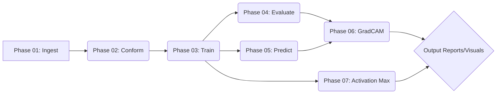

# System Patterns: AI Ophthalmology - Glaucoma Detection Pipeline

## Architecture Overview

The system is designed as a modular, multi-phase pipeline executed via a command-line interface (CLI) built with Python and `click`. Each phase represents a distinct step in the workflow (ingest, conform, train, evaluate, predict, visualize).

## Key Technical Decisions

-   **Modularity:** Each pipeline phase is implemented as a separate Python module within `src/pipeline/`, promoting separation of concerns and independent execution.
-   **CLI Control:** `click` library provides a user-friendly CLI for running phases and passing parameters. `src/cli.py` acts as the central orchestrator.
-   **Configuration:** Global settings are managed in `config.yaml`, while phase-specific settings can reside in `config.yaml` files within each phase directory. A central `config_loader.py` merges these.
-   **Data Flow:** A structured `data/` directory is used, with subdirectories for raw data, conformed data (run-specific copies), trained models, evaluation results, prediction inputs/outputs, and visualizations. This promotes organization and reproducibility. Run-specific outputs are generally tied together by a `run_id`.
-   **Model Metadata:** Trained models are saved alongside a JSON metadata file (`model_metadata.json`) capturing architecture details, training parameters, and normalization stats, ensuring consistency across phases.
-   **Explainability:** Dedicated phases (06 GradCAM, 07 Activation Maximization) are included to provide insights into model behavior, generating visual reports.

## Component Relationships

-   `main.py` / `cli.py`: Entry point, parses commands, loads global config, dynamically imports and executes the appropriate phase module's `run_phase` function.
-   `Phase Modules` (`src/pipeline/phaseXX/main.py`): Contain the core logic for each step. They typically load necessary configurations, interact with data handling/model modules, perform their task, and save outputs to the designated `data/` subdirectory based on the `run_id`.
-   `config_loader.py`: Provides functions to load and merge YAML configuration files.
-   `src/data_handling/`: Contains `datasets.py` (using `ImageFolder`, `ImageFolderWithPaths`) and `transforms.py` (defining image preprocessing/augmentation) used by multiple phases.
-   `src/models/`: Defines the model architecture (`mobilenetv3/model.py` extending `base_model.py`) including the `get_model` factory and metadata generation.
-   `src/utils/`: Contains shared helper functions for logging (`logger.py`) and file operations (`file_utils.py`).

## Critical Implementation Paths

-   **Data Conformance (Phase 02):** Crucial for creating the consistent `ImageFolder` structure used by subsequent phases.
-   **Model Training & Saving (Phase 03):** Core ML step; saving the model weights and correct metadata is vital.
-   **Model Loading (Phases 04, 05, 06, 07):** Reliably loading the correct model weights and using associated metadata (especially normalization) based on `run_id`.
-   **CLI Orchestration:** Correctly parsing arguments, determining `run_id`, loading configs, and calling the appropriate `run_phase` function.
